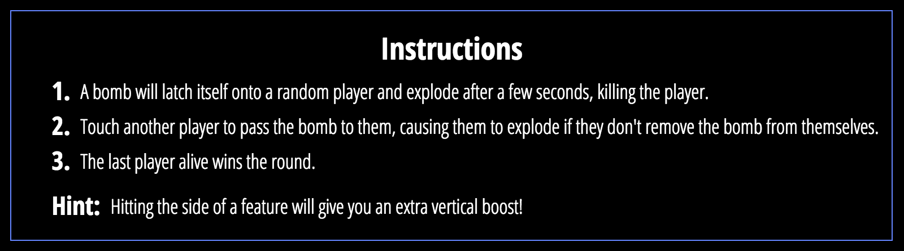
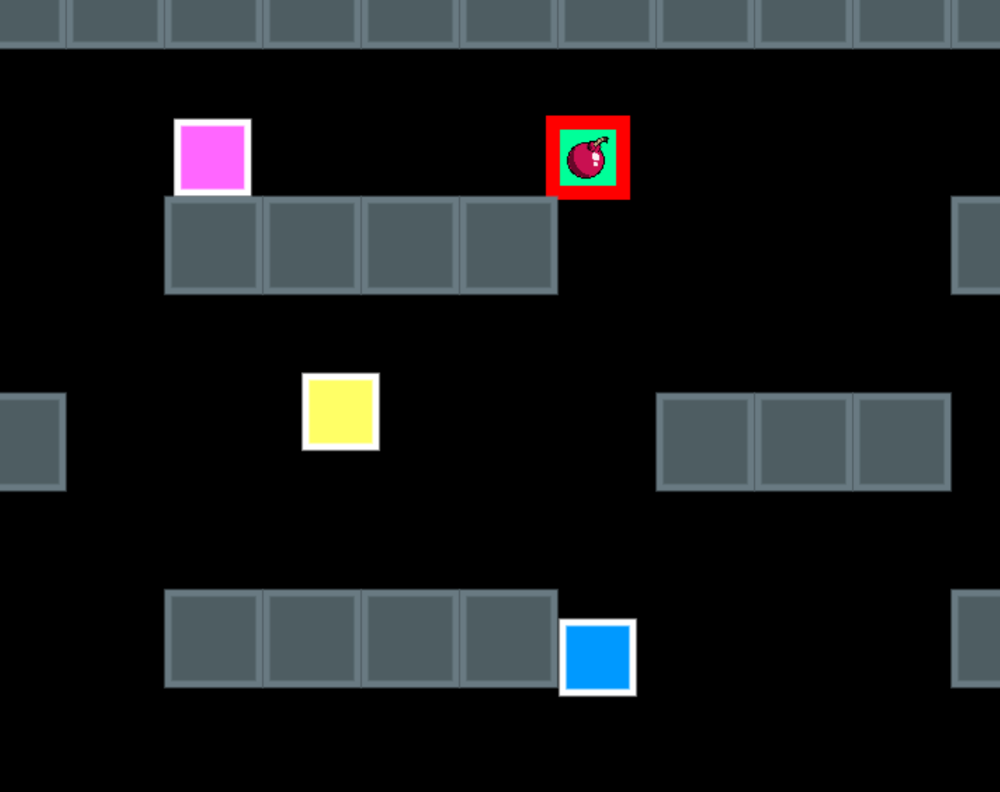
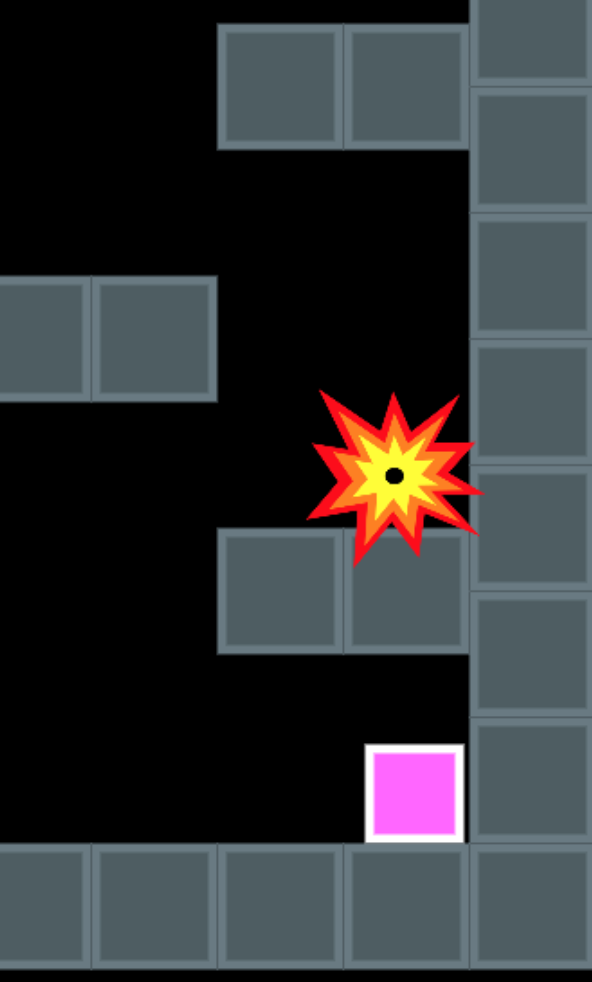
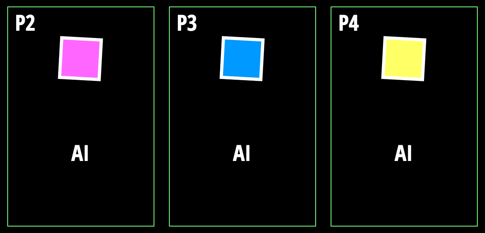

[Bomb Tag live][github]

[github]: https://eliasylee.github.io/bomb_tag/

Bomb Tag is made with Javascript and utilizes HTML5/Canvas for rendering the game. Based on the Bomb Tag level from the game Move or Die, the premise of the game is as follows:







## Features and Implementation

### Physics

In making Bomb Tag, I made the decision to roll my own physics into the game. Things such as gravity, collision, and friction were hard-coded into the game.

```javascript
friction () {
  if (this.vel[0] > 0) {
    this.vel[0] -= 0.5;
  } else if (this.vel[0] < 0) {
    this.vel[0] += 0.5;
  } else {
    this.vel[0] = 0;
  }
}
```

```javascript
gravity () {
  if (this.vel[1] < 20) {
    this.vel[1] += 1;
  }
}
```

```javascript
/* Ensure Character position does not pass through borders. */
if (this.pos[0] < 75) {
  this.pos[0] = 75;
}
if (this.pos[0] > 1140) {
  this.pos[0] = 1140;
}
if (this.pos[1] < 75) {
  this.vel[1] *= -0.5;
}
if (this.pos[1] > 580) {
  this.pos[1] = 580;
  this.canJump = true;
}
```

Also, each object, including every single block in the game, was created from a `Feature` class. No library was involved in the development process.

```javascript
  this.features.push(new Feature([75, 5]));
  this.features.push(new Feature([145, 5]));
  this.features.push(new Feature([215, 5]));
  this.features.push(new Feature([285, 5]));
  this.features.push(new Feature([355, 5]));
  this.features.push(new Feature([425, 5]));
```

### Artificial Intelligence



The AI players were coded in order to provide a challenge to the lone user playing Bomb Tag. Whereas an ordinary AI player is given random actions, one that has been tagged with a bomb first checks the surviving players.

```javascript
players.forEach( player => {
  if (player !== aiPlayer && !directionX) {
    let distX = aiPlayer.pos[0] - player.pos[0];
    let distY = aiPlayer.pos[1] - player.pos[1];

    directionX = distX;
    directionY = distY;
  }
});
```

If the user is still alive, the AI player with the bomb will have calculated the difference in distance between its and the user's positions. If not, it will have grabbed the position of the next AI player. Next, bombed AI player checks the direction of the targeted player and calls on the `character` method `impulse` to move in that direction.

```javascript
    if (directionY > 0) {
      aiPlayer.impulse([0, -20]);
    }

    if (directionX > 0) {
      aiPlayer.impulse([-10, 0]);
    } else {
      aiPlayer.impulse([10, 0]);
    }
  } else {
    let ran = Math.floor(Math.random(0, 1) * 3);
    aiPlayer.impulse(AI_MOVES[ran]);
  }
});
```

If the AI player is below its target, it jumps in addition to moving in its targeted direction.

## Future Development

### Player and A.I. Selection

At the moment, the user's only choice is to play against 3 A.I. players. In the future, I plan on adding functionality for selecting not only the number of opponents but also whether the opponents are humans or computers.

### A.I. Players

When coding the A.I. logic, I initially had the non-bombed A.I. players simply move in the opposite direction from the bombed player. However, this only led them to move directly into either wall and stay there. One possible fix is to have each non-bombed A.I. player check for the position of the bombed player and only move in the opposite direction when within a certain proximity. This would, however, inevitably lead to the running-away player to only move towards a wall in certain scenarios, so it is a non-satisfactory fix. A solution that holds more promise is coding the A.I. players to act more human-like in that they should move *towards* a bombed player when within a certain proximity while also jumping, but otherwise move away. There is the possibility of allowing A.I. players to check a bombed player's velocity as well as the position and make decisions based on that.

### Character Appearances

Characters are currently colored boxes. There is a lot of potential here for unique characters, customized characters, and character selection at the start screen.

### Scores and Rounds

Currently, each game round is independent, leaving long-term playability of the game limited. A possible fix in the future is to integrate users and allow for separate sessions where players play multiple rounds together to win points and eventually with the game session. This, of course, would require either local play functionality, which is unideal, or WebSocket integration, which would be better.

### Physics Engine

The current physics "engine" is for the most part functional, but occasionally buggy. An obvious option would be to refactor the game towards using a physics engine library. However, certain unintended side-effects within Bomb Tag are, in my opinion, additions to the game that would be better left in. Still, integrating a physics engine is a possibility for the distant future.
